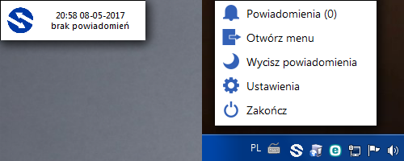

</img>

## Opis
WINEASIER jest zbiorem małych aplikacji, których celem jest usprawnienie i ułatwienie pracy na komputerze. Pozwala także na tworzenie skrótów do ulubionych aplikacji czy automatyzację niektórych czynności.

## Instalacja i pierwsze uruchomienie
Aby zainstalować aplikację WINEASIER należy wykonać następujące czynności:

1. Pobierz instalator najnowszej wersji z zakładki "Releases" na GitHubie, a następnie uruchom go z uprawnieniami administratora

2. Postępuj zgodnie z instrukcjami instalatora aplikacji

3. Po pomyślnym zainstalowaniu pierwsze uruchomienie aplikacji neleży przeprowadzić ręcznie. W tym celu wyszukaj skrót do aplikacji na liście "wszystkich aplikacji" w menu Start systemu Windows i uruchom go (skrót jest widoczny tylko na tym koncie, na którym została przeprowadzona instalacja)

4. Pierwsze uruchomienie aplikacji spowoduje wyświetlenie krótkiego wprowadzenia do działania aplikacji

5. Po zamknięciu wprowadzenia aplikacja jest gotowa do pracy. Aby wywołać menu podręczne aplikacji skorzystaj z ikony aplikacji widocznej na pasku systemowym obok zegara lub "uderz" kursorem komputera w górny lewy róg ekranu, a następnie kliknij na małe okno aplikacji, które pojawi się w tym narożniku

6. W ustawieniach aplikacji możliwe jest spersonalizowanie zawartości menu podręcznego, zmiana narożnika ekranu, przypisanie skrótów klawiszowych i wiele więcej...

[Otwórz stronę releases](https://github.com/adan2013/WINEASIER/releases)

## Wygląd aplikacji
Ponieżej przedstawiam dodatkowe zrzuty ekranu prezentujące działanie aplikacji: